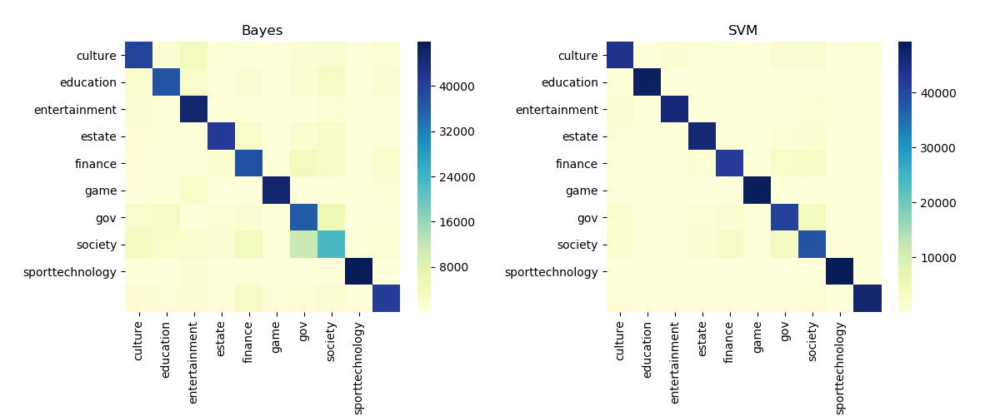
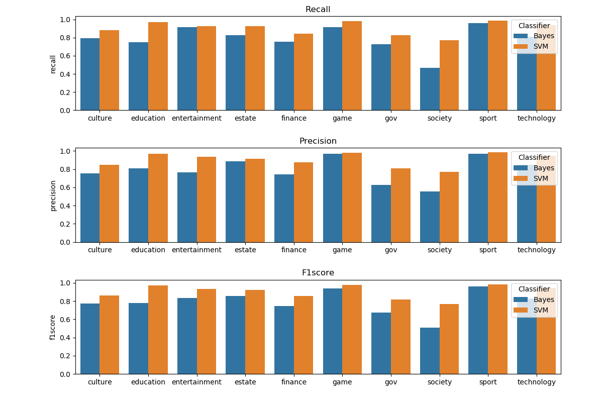

# 新浪新闻文本分类

## 语料库构建

本项目的语料来源新浪新闻网，通过 _spider.py_ 爬虫模块获得全部语料，总计获得10类新闻文本，每一类新闻文本有10w篇。

* 借助新浪新闻网的一个api获取新闻文本，api的url为[http://api.roll.news.sina.com.cn/zt_list?](http://api.roll.news.sina.com.cn/zt_list?)

* 使用进程池并发执行爬虫，加快抓取速度。

## 数据预处理

本项目的数据预处理包括：分词处理，去噪，向量化，由 _stopwords.py_ 模块、_text2term.py_ 模块、_vectorizer.py_ 模块实现。

* 本项目借助第三方库 _jieba_ 完成文本的分词处理。

* 通过停用词表去除中文停用词，通过正则表达式去除数字（中文数字&阿拉伯数字）。

```python
filter_pattern = re.compile(ur'[-+]?[\w\d]+|零|一|二|三|四|五|六|七|八|九|十|百|千|万|亿')
```

* 使用进程池并发执行数据的分词和去噪，加快数据预处理的过程。

* 把数据集1:1划分为训练集和测试集，各50w篇文档。

* 借助scikit-learn提供的`CountVectorizer`类完成向量化，得到训练集和测试集两个文本的特征矩阵，矩阵类型为稀疏矩阵。

* 去除文档中文档频率小于0.1%的特征，这些特征我们认为出现的频率实在太低同时也不可能为某类文档的局部特征，以此完成降维，最终特征矩阵的维度大约为19543维。

## 朴素贝叶斯分类

本项目使用朴素贝叶斯作为本项目文本分类的baseline，由 _baseline.py_ 模块实现。

* 平滑处理

* 处理零概率

* 最终分类结果：
最高召回率:0.95 | 最低召回率:0.46 | 平均召回率:0.79
最高精确度:0.96 | 最低精确度:0.55 | 平均精确度:0.78
最高F1测度:0.93 | 最低F1测度:0.50 | 平均F1测度:0.79

## SVM分类

本项目使用SVM作为最终的文本分类器，由 _svm.py_ 模块实现其中SVM的核函数选用线性核，特征矩阵投入训练前经过词频加权.

* 借助`TfidfTransformer`使用TF-IDF对词频进行加权

* 选用线性核`LinearSVC`

* 结合5折交叉验证和网格搜索`GridSearchCV`完成调参

* 最终分类结果：
最高召回率:0.99 | 最低召回率:0.77 | 平均召回率:0.90 
最高精确度:0.98 | 最低精确度:0.77 | 平均精确度:0.90 
最高F1测度:0.99 | 最低F1测度:0.77 | 平均F1测度:0.90

## 可视化

比较SVM分类器和贝叶斯分类器的分类性能，通过可视化的方式比较两者的预测结果，由 _viewer.py_ 模块实现。

### 混淆矩阵热力图



### 性能对比直方图



